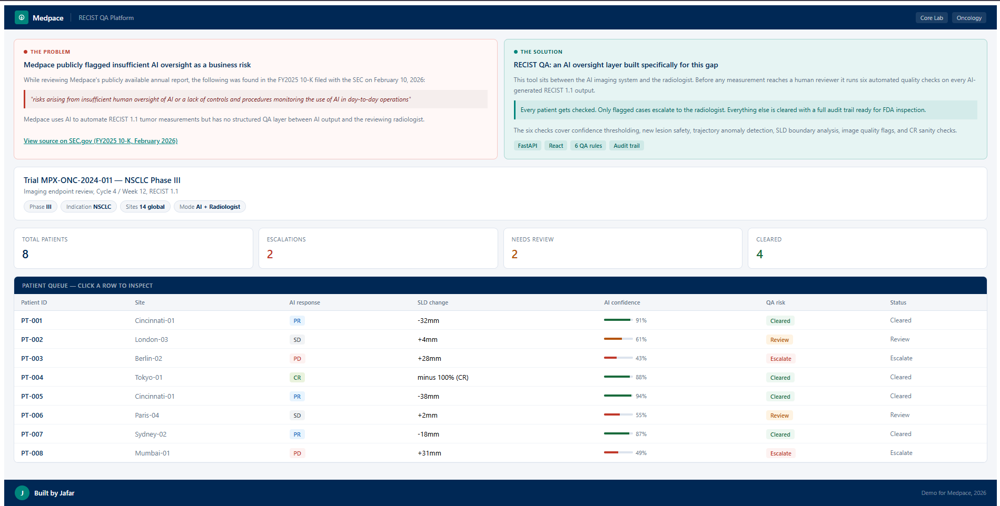
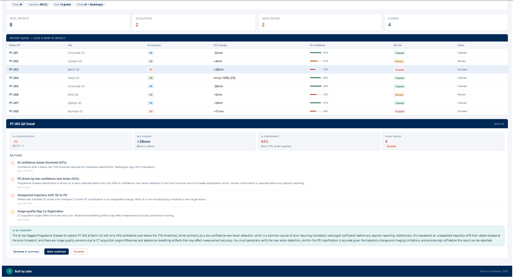

# RECIST QA Platform

AI Measurement Validation and Oversight Layer for Oncology Clinical Trials

Built by Jafar | Demo for Medpace | 2026

## The Problem

While reviewing Medpace's publicly available annual report, the following risk was identified in the FY2025 10-K filed with the SEC on February 10, 2026:

> "risks arising from insufficient human oversight of AI or a lack of controls and procedures monitoring the use of AI in day-to-day operations"

Source: https://www.sec.gov/Archives/edgar/data/0001668397/000166839726000006/medp-20251231.htm

Medpace uses AI to automate RECIST 1.1 tumor measurements in oncology trials but has no structured validation layer between AI output and the reviewing radiologist. Low confidence classifications, new lesion detection errors, and image quality issues can pass through unchecked before reaching clinical decision makers.

## The Solution

RECIST QA sits between the AI imaging system and the radiologist. Before any measurement reaches a human reviewer it runs six automated quality checks on every AI-generated RECIST 1.1 output. Only flagged cases escalate. Everything else is cleared with a full audit trail ready for FDA inspection.

## Screenshots

### Dashboard  Trial Overview and Patient Queue


The dashboard gives an instant read on the entire trial cohort. The top panel shows the business context -the exact SEC filing language that motivated this tool. Below it, the stats row surfaces the key numbers at a glance: 8 patients reviewed, 2 escalated, 2 flagged for review, 4 cleared. The patient queue lists every case with its AI response (PR/SD/PD/CR), SLD change in mm, a color-coded confidence bar, and a QA risk badge -so a radiologist knows immediately which cases need their attention and which are already cleared.

### Patient Detail -QA Flags and AI-Generated Radiologist Brief


Clicking any patient row expands the full QA detail panel. This view shows PT-003 (Berlin-02), flagged for escalation with 4 issues: AI confidence of only 43% (well below the 75% threshold), a Progressive Disease classification driven by a new lesion detected at just 43% confidence, an unexpected trajectory shift from Stable Disease to PD, and a co-registration image quality warning. The AI QA Summary box at the bottom uses Claude to generate a plain-language brief written specifically for the reviewing radiologist -summarizing what the flags mean and exactly what action is required before the result can be reported.

## Quickstart

Step 1: Add your API key

```
cd backend
cp .env.example .env
# Open .env and paste your Anthropic API key
```

Step 2: Run the backend

```
cd backend
pip install -r requirements.txt
uvicorn main:app --reload
```

Step 3: Run the frontend in a second terminal

```
cd frontend
npm install
npm run dev
```

Step 4: Open http://localhost:3000

## The Six QA Rules

| Rule | Description |
|------|-------------|
| CONF-001 | AI confidence below 75% threshold |
| NL-001 | PD driven by low-confidence new lesion |
| TRAJ-001 | Unexpected response trajectory shift |
| THRESHOLD-001 | SLD change near SD/PR boundary |
| IQ-001 | Image quality issues |
| CR-001 | CR classification with residual SLD |

## API Endpoints

| Endpoint | Method | Description |
|----------|--------|-------------|
| `/` | GET | Health check |
| `/qa/validate` | POST | Run all 6 QA checks on a patient measurement |
| `/qa/summarize` | POST | Run checks + generate AI plain-language brief |
| `/qa/review` | POST | Log radiologist action to audit trail |
| `/qa/audit` | GET | Retrieve full audit log |

## Stack

- **Backend:** FastAPI + Python
- **Frontend:** React + Vite
- **AI summaries:** Anthropic API (Claude)
- **Audit trail:** In-memory log

## Built by

Jafar, AI/ML Engineer, Cincinnati OH
</content>
